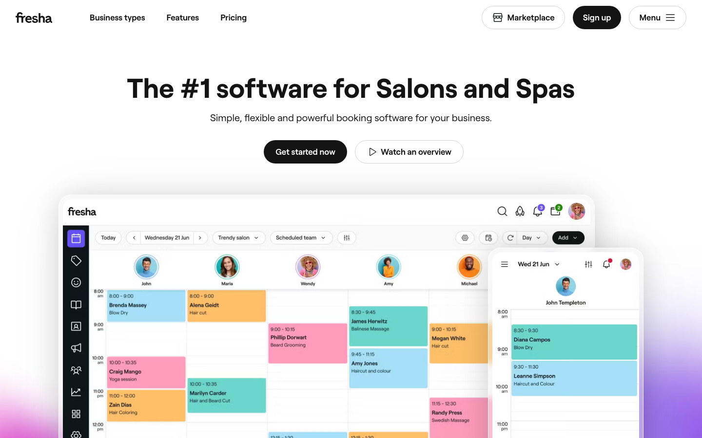
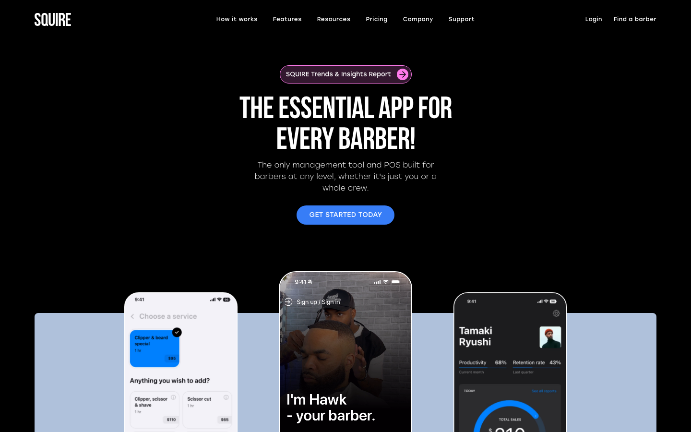
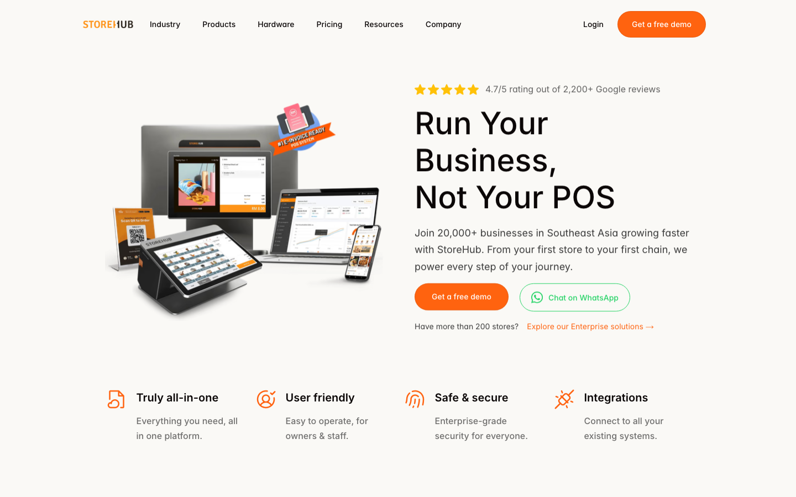
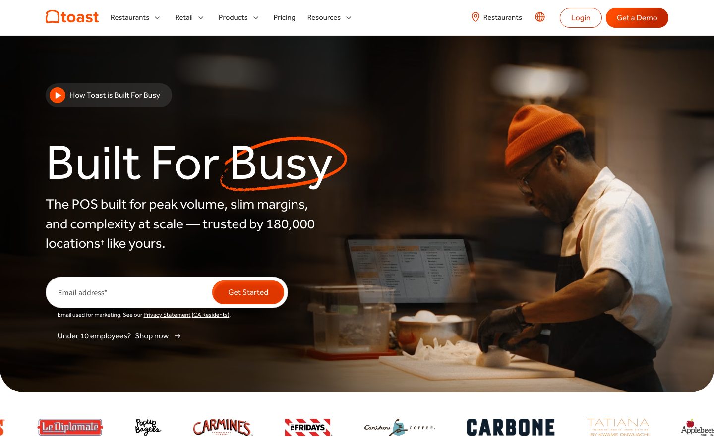
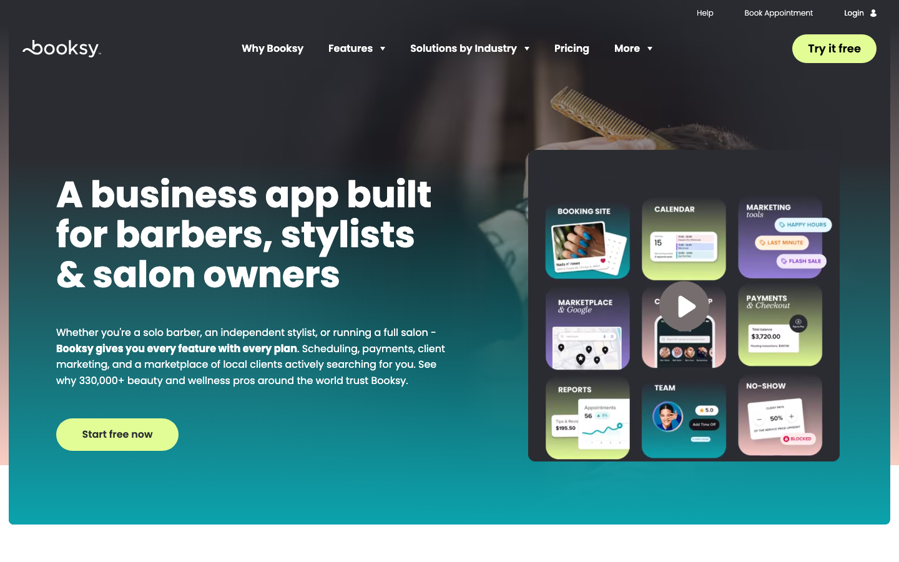
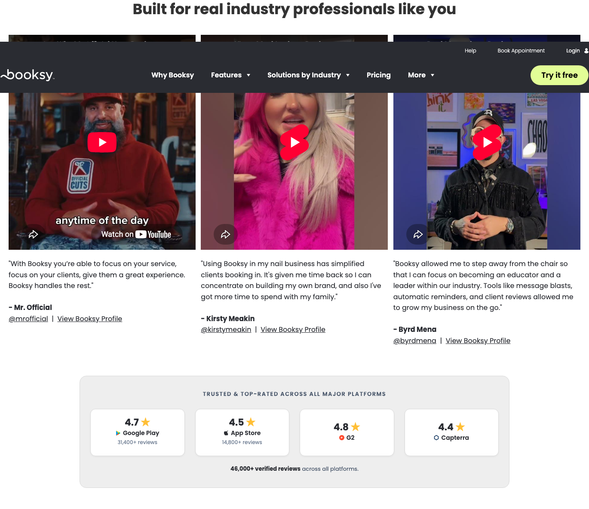
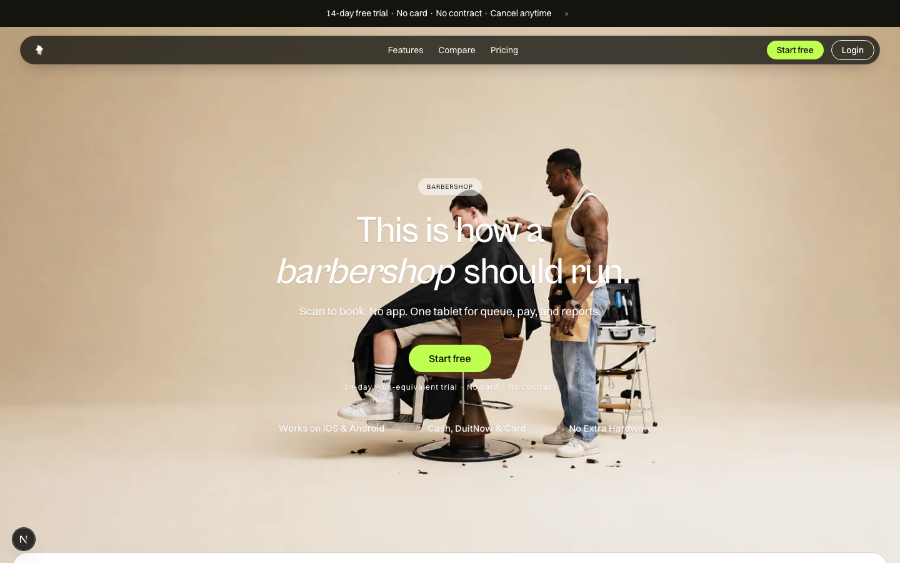
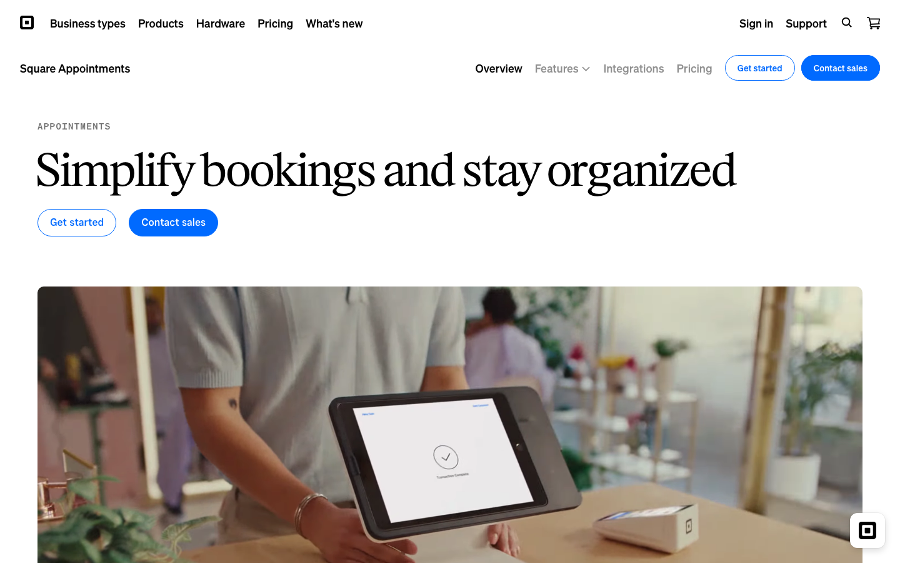

# Barbershop hero and proof - benchmark examples

**TL;DR:** The hero trails the market: every peer shows product or proof in the fold, Meikigo shows only a barber photo.

- Strong pages put a verifiable number or rating next to the headline and name the audience in the H1 or sub.
- Peers pair the main CTA with a softer path: an overview video, or WhatsApp chat in Malaysia (StoreHub).

## Patterns

### 1. The product owns the fold (start here)

A cold visitor knows it is software in one glance. Fresha, Squire and StoreHub fill half the hero with real screens, not a lifestyle photo.

- Put the tablet queue board and the phone booking #42 screen in the hero, framed as devices.
- Keep a barbershop photo only as background context behind the devices, not instead of them.
- Reuse the screens already built for the three-screens section so no new design work is needed.

**Option A · Fresha.** Real desktop and phone calendar dominate the fold. Watch an overview sits beside Get started as the soft path.

**Option B · SQUIRE.** Sub says the only POS built for barbers, solo or whole crew. Booking, barber and reports screens show every side.

**Option C · StoreHub.** Local peer. 4.7/5 from 2,200+ Google reviews sits above the H1, and Chat on WhatsApp is the secondary action.

### 2. A checkable number sits next to the headline

StoreHub puts a Google rating above its H1, Toast names 180,000 locations in the sub. The proof lands before the visitor reads the pitch.

- Do not invent a count. Collect Google Business Profile reviews first, then show the real rating above the H1.
- Until then, use a factual line such as the RM109 price floor or supported payment rails as the proof slot.

**Option A · StoreHub.** Local peer. 4.7/5 from 2,200+ Google reviews sits above the H1, and Chat on WhatsApp is the secondary action.

**Option B · Toast.** Trusted by 180,000 locations sits inside the sub. A video pill above the H1 offers the low-commitment path.

### 3. The H1 or sub names who it is for and why it differs

Booksy names barbers, stylists and salon owners. Squire says the only POS built for barbers, solo or whole crew. Readers self-select in seconds.

- Name barbershops and unisex salons, from one chair to multi-outlet, in the sub.
- State the difference from booking apps in one line: booking, queue, payment and report on one tablet.

**Option A · Booksy.** The H1 is the audience. The sub adds every feature on every plan and 330,000+ pros, then one CTA.

**Option B · SQUIRE.** Sub says the only POS built for barbers, solo or whole crew. Booking, barber and reports screens show every side.

### 4. A softer second action beside the main CTA

Fresha pairs Get started with Watch an overview. StoreHub pairs its demo with Chat on WhatsApp, the channel Malaysian owners already use.

- Add a Chat on WhatsApp button next to Start free, styled as secondary.
- Or add a 60-second queue walkthrough video as the secondary action.

**Option A · Fresha.** Real desktop and phone calendar dominate the fold. Watch an overview sits beside Get started as the soft path.

**Option B · StoreHub.** Local peer. 4.7/5 from 2,200+ Google reviews sits above the H1, and Chat on WhatsApp is the secondary action.

### 5. Testimonials a visitor can verify

Booksy shows video quotes with a real name, social handle and a link to the pro's live booking profile, then review-site ratings below.

- Replace the current quotes only with real pilot shops that agree to be named, with a photo or short clip.
- Link each quote to the shop's live Meikigo booking page or Google profile.
- Until pilots sign off, drop the section rather than show unverified names.

**Booksy.** Each quote has a name, social handle and a link to the pro's live profile. Review-site ratings follow directly.

## What's working (keep these)

- One CTA label, Start free, with no card and no contract right under it. Stronger risk reduction than Square or Toast.
- Transparent RM pricing on the page. Toast and Square push demos or sales contact first.
- An honest compare against typical booking apps, a move only Toast makes among these peers.

## Gap analysis

| Dimension | Current | Strong pattern | Gap |
|---|---|---|---|
| Product visual | Barber photo only, no UI in the fold | Real product screens fill half the hero | HIGH |
| Testimonial credibility | First-name quotes, unverified shop names, pilot note visible | Named pros with handle, video and link to live profile | HIGH |
| Proof next to headline | Capability ticker, no number or rating | Rating or customer count above or inside the H1 block | MEDIUM |
| Audience and difference | Manifesto H1, audience implied by a pill | H1 or sub names who it is for and the one difference | MEDIUM |
| Secondary action | Start free is the only path | Overview video or WhatsApp chat beside the main CTA | MEDIUM |
| Hero readability | White sub and trial line on light beige photo | Dark text on light ground or light text on a dark overlay | LOW |

## All references

**Meikigo.** Photo-led fold with no product, no number, and a low-contrast trial line.

**Square.** Plain outcome H1 and a real counter tablet in use. Two CTAs compete at similar weight, a move to avoid.

## Current reality (context)

- **Headline.** This is how a barbershop should run.
- **Subheadline.** Scan to book. No app. One tablet for queue, pay, and reports.
- **CTA.** Start free, with 14-day Plus-equivalent trial · No card · No contract below
- **Hero visual.** Barber and client photo on beige backdrop
- **Proof.** Capability ticker; two first-name quotes further down

---

Live captures of public pages on 2026-09-28, desktop 1440x900. No Web Anatomy benchmark data: the MCP was not connected.
